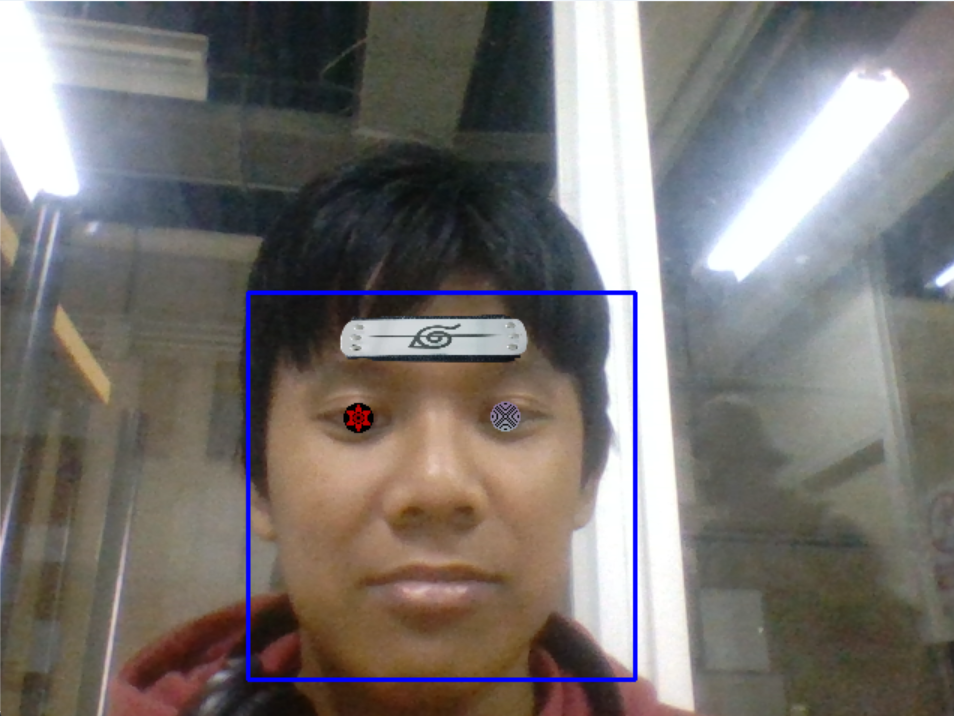

# P4-Detección-de-caras

###  Desarrollo

## Detección de cara y filtro

***El código abre la webcam y mediante un detector de caras detecta una cara y le añade un filtro de Sasuke.***

- `sharingan = cv2.imread("media/sasuke_sharingan.png", cv2.IMREAD_UNCHANGED)`. Carga la imagen png con fondo transparente.
- Es necesario cambiar el tamaño del canal *alpha* de la imagen y convertirlo a tres canales para que la imagen se pueda ver correctamente en la cámara.
- Se coloca la imagen encima del frame teniendo en cuenta el canal alpha.
  ```py
  frame[(int)(ley) - 10:(int)(ley) + 10, (int)(lex) - 10:(int)(lex) + 10] = \
                frame[(int)(ley) - 10:(int)(ley) + 10, (int)(lex) - 10:(int)(lex) + 10] * \
                (1 - sharingan_with_alpha[:, :, 3:] / 255.0) + \
                sharingan_with_alpha[:, :, :3] * (sharingan_with_alpha[:, :, 3:] / 255.0)
  ```
Para el resto de imágenes añadidas se ha seguido el mismo proceso.



Imagen: Detección de cara con filtro de Sasuke


## Fuentes de información

- Para realizar el pixel-wise blending para el canal alpha [stackoverflow](https://stackoverflow.com/questions/66339930/when-pasting-an-image-on-another-image-how-to-keep-the-foreground-image-transpa)

Realizado por:
- Eduardo Etopa Lechuga
- Willy Escovilla Biason


